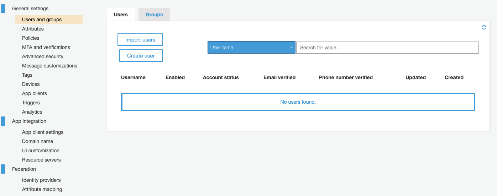
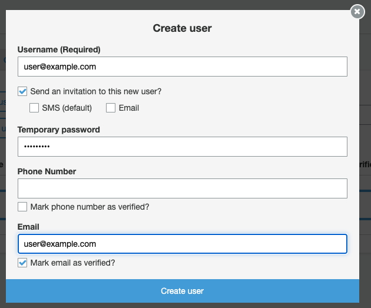
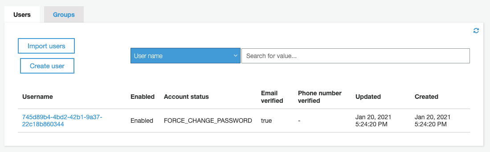
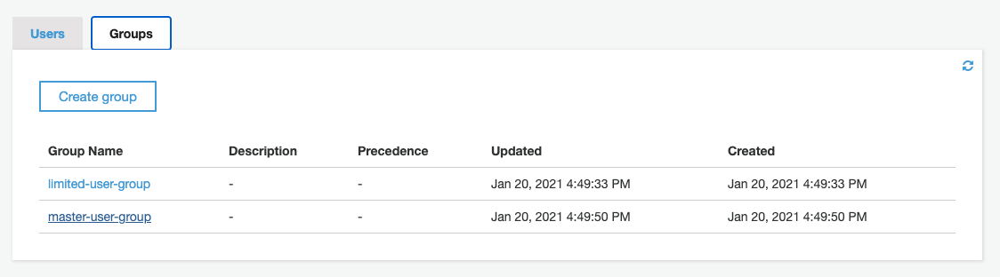
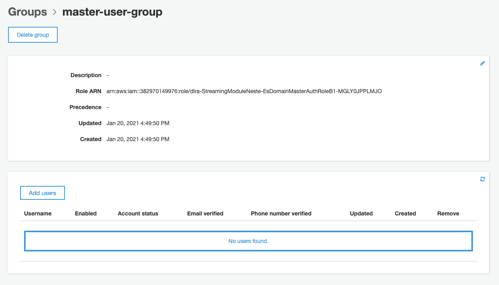
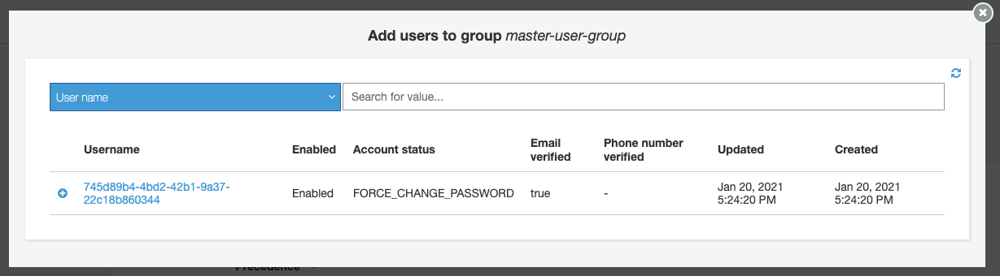
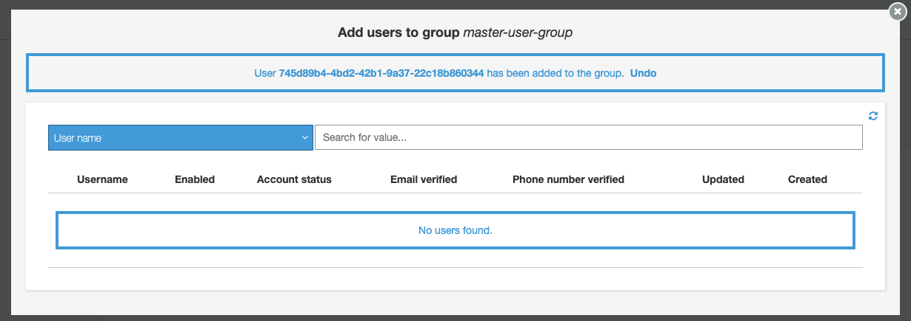

# AWS Analytics Reference Architecture

The AWS Analytics Reference Architecture is a set of analytics solutions put together as an end-to-end example.
It regroups AWS best practices for designing, implementing, and operating analytics platforms through different purpose-built patterns, handling common requirements, and solving customers' challenges.

This repository contains the codebase and getting started instructions of the AWS Analytics Reference Architecture.
<!-- TODO: Update the link in the next line -->
The background of this project, the description of the business cases, architecture, and individual patterns can be found in the [documentation](https://aws-samples.github.io/aws-analytics-reference-architecture/).


## Table of Contents

1. [Documentation](#getting-started---deploying-the-project)
1. [Getting started - Deploying the Project](#getting-started---deploying-the-project)
    1. [Prerequisites](#prerequisites)
    1. [Deployment](#deployment)
    1. [Adding users to Kibana](#adding-users-to-kibana)
    1. [Connecting to Amazon Redshift](#connecting-to-amazon-redshift)
         1. [psql](#psql)
   1. [Clean up](#clean-up)
1. [Contributing](#contributing)


## Documentation

Return to [Live Docs](https://aws-samples.github.io/aws-analytics-reference-architecture/).

## Getting started - Deploying the Project

This section describes all steps that have to be performed to deploy the AWS Analytics Reference Architecture into an AWS account.

### Prerequisites

Before starting the deployment, ensure that the following steps are completed.

1. [Create an AWS account](https://aws.amazon.com/premiumsupport/knowledge-center/create-and-activate-aws-account/)
2. The Analytics Reference Architecture can only be deployed in **eu-west-1** for the moment
3. [Subscribe to Amazon QuickSight](https://docs.aws.amazon.com/quicksight/latest/user/signing-up.html) (if you plan to deploy the data visualization module)
4. Install the following components with the specified version on the machine from which the deployment will be executed:
    1. Python [3.8-3.9.2]
    2. Node [<15.6]
    3. Git
    4. AWS CDK: Please refer to the [Getting started](https://docs.aws.amazon.com/cdk/latest/guide/getting_started.html) guide.

### Deployment
 
1. Clone this repository onto the machine from which you want to execute the deployment.

   ```
   git clone https://github.com/aws-samples/aws-analytics-reference-architecture.git
   ```

2. Create a Python virtual environment in the project's directory, source it, and install all dependencies.

   ```
   cd aws-analytics-reference-architecture/refarch/aws-native
   python3 -m venv .env
   source .env/bin/activate
   pip install -r requirements.txt
   ```

3. Deploy the main AWS CDK stack into your AWS account, providing the required parameters.
If you install all modules, the Amazon QuickSight username (which can also be an IAM role) to which access should be granted to, as well as your QuickSight home region (the one selected during the QuickSight sign-up process) have to be specified. 

   ```
   cdk deploy -c QuickSightUsername=<ROLE/USERNAME> -c QuickSightIdentityRegion=<REGION>
   ```

   Alternatively or additionally, you can disable modules.
The batch, data warehouse, data visualization, and streaming modules can be enabled/disabled using the respective context variable: `EnableBatch`/`EnableDWH`/`EnableDataviz`/`EnableStreaming`.
To disable, for example, the data visualization module, the following argument has to be used.
   ```
   cdk deploy  -c EnableDataviz=false
   ```
**Note**: If using CICD deployments as described in the following step, these context variables must also be set in `refarch/aws-native/cdk.json`.
This is because when the pipeline picks up any changes to the tracked repository, it will use these values as opposed to command line ones. 

4. Additionally, The Analytics Reference Architecture comes with constructs to allow for CICD deployments through the use of CodePipeline.
   In order to deploy in this manner, there are a few steps that must be performed to allow for integration with your code repository
   of choice and to specify the environments in which you would like to deploy. Currently, Connections allows for integration
   with Github, Github Enterprise, and Bitbucket. Alternatively, any code source supported by CodePipeline can be specified
   by modifying the `input` parameter of the synthesis step in the pipeline found in `refarch/aws-native/cicd/pipeline.py`
   
   * Create a CodeStar Connection to allow CodePipeline to pull changes from your repository.
      * Follow the steps here to create a Connection with your repository: [CodeStar Connections](https://docs.aws.amazon.com/dtconsole/latest/userguide/connections-create.html)
        Note that this should be done in the account that you're planning to use to host your pipeline.
      * Copy the arn of the connection you have created, and paste it into the `ConnectionArn` field of `refarch/aws-native/cdk.json`
      * Also specify the `RepositoryName` (e.g. `githubid/myrepo`) and `RepositoryBranch` context variables for the repo and branch that should be tracked, respectively
      * Finally, in the same file, enable CICD deployments by setting the `EnableCICD` context variable to `true`
        * If this is not done then the pipeline will not be synthesized and/or updated when using either `cdk deploy` or `cdk synth`
   * Specify the details of your CICD account in `refarch/aws-native/cdk.context.json`
      * Replace <CICD_REGION> and <CICD_ACCOUNT> in the file with the region and account number for your CICD account
   * In that same file, `refarch/aws-native/cdk.context.json` also put the values for the accounts that you are planning to deploy to, for the respective stages.
      * These values can either be the same as the ones for the CICD account or another account that you own.
      * By default, there are two deployment environments specified - DEV and PROD. You can add or take away environments as you wish,
        simply note that you will also have to update the corresponding environment inputs to the pipeline in `refarch/aws-native/app.py`.
   * Bootstrap your CICD account with the modern stack style.
      * First, retrieve credentials for your CICD account.
      * Second, run the command `export CDK_NEW_BOOTSTRAP=1`. Setting this environment variable tells the CDK to bootstrap
        the account with the new stack style rather than the default legacy one. This is required to give CodePipeline the
        appropriate roles and permissions to deploy to the account.
      * Run the command `cdk bootstrap aws://<CICD_ACCOUNT>/<CICD_ACCOUNT_REGION>`  
   * Bootstrap your target accounts, so they have a trust relationship with your CICD account.
      * First, retrieve credentials for the target account that you plan to deploy the reference architecture into.
      * Second, run the command `export CDK_NEW_BOOTSTRAP=1`. Your target accounts also need to be bootstrapped with the new
        stack style to allow CodePipeline to deploy to them.
      * Finally, run the command `cdk bootstrap --trust <CICD_ACCOUNT> --cloudformation-execution-policies arn:aws:iam::aws:policy/AdministratorAccess aws://<TARGET_ACCOUNT>/<TARGET_ACCOUNT_REGION>`
         * This creates a trust relationship between your target account and your CICD so that the pipeline can deploy resources
           into your target account
         * **Important Note**: By specifying the AdministratorAccess policy you are giving the CDK full admin privileges to deploy
           to your account. In the case of any security concerns, this can be changed to a more restrictive policy depending on your
           security requirements.
  * Finally, run `cdk deploy PipelineStack` using the credentials for your CICD account.
      * This will deploy the stack containing the pipeline to your CICD account, and cause it to automatically start pulling any changes
        from the repo that you have specified
        
   ---
   **NOTE:**
   Step 5 and 6 only have to be executed if the data visualization module has been installed.
   ---
5. Configure Amazon QuickSight:
    * To link the clean data S3 bucket to the QuickSight account:
        * Visit the [QuickSight web console](https://quicksight.aws.amazon.com)
        * Click on your username in the upper right corner
        * Go to "Manage QuickSight"
        * Click "Security & permissions"
        * Select "Add or remove" in the "QuickSight access to AWS services" section
        * Click on the "Details" link at "Amazon S3" and click the "Select S3 buckets" button
        * Select, i.e., check the box of, the S3 bucket named like the value of the CloudFormation output key `CleanS3Bucket` from the main CDK stack (named `ara`) deployed into your account. The bucket name has the following format: `ara-clean-data-<account-id>`
        * Click "Finish" and then "Update" to confirm the selection 
    * To create the QuickSight VPC Connection:
        * Visit the [QuickSight web console](https://quicksight.aws.amazon.com)
        * Click on your username in the upper right corner
        * Go to "Manage QuickSight"
        * Click "Manage VPC connections"
        * Click "Add VPC connection"
        * Enter a "VPC connection name" of your choice, e.g., `ara`
        * Choose the "VPC ID" as the value of the CloudFormation output key `VPCID` from the main CDK stack (named `ara`) deployed into your account
        * Select one of the subnets that <strong>IS NOT</strong> shown in the outputs `SUBNETID0` and `SUBNETID1` from the main CDK stack
        * Copy and paste the value of the CloudFormation output key `QuickSightSecurityGroupId` from the main CDK stack into the "Security Group ID" field
        * Click "Create"
        * Note down the "VPC connection ARN" of the newly created VPC connection shown on the "Manage VPC connections" page

6. Deploy a second CDK stack, called `DataVizRedshiftStack`, passing the ARN of the VPC connection from the previous step.

   ```
   cd dataviz/dataviz_redshift_cdk
   cdk deploy --parameters VpcConnectionArn=<VPC_CONNECTION_ARN>
   ```

### Adding users to Kibana

The main CDK stack also deploys the streaming module (if not explicitly disabled), which includes:

* Streaming data generation from TPC-DS to Kinesis and S3
* The Kinesis Data Analytics for Flink application
* The Amazon Elasticsearch Service domain

Once deployed, you need to create a master user for Elasticsearch and add it to the master group in Amazon Cognito.

Open the Cognito UI in the AWS console, select "Manage User Pools", click on the user pool named `ara_user_pool`, and choose the "Users and groups" menu. To start adding a new user, click the "Create user" button:



In the pop-up dialog, provide a username, password, and e-mail address, check "Send an invitation to this new user?" and "Mark email as verified?", uncheck "Mark phone number as verified?", and confirm with "Create user" to add the new master user:



The master user is created with a temporary password that has to be changed at first authentication. Note the unique user identifier (UUID) displayed in the "Username" column as shown on the next screen:



Now, add the master user to the `master-user-group` that has been created by the CDK stack. Switch to the "Groups" tab and select the group's name:



Click the "Add users" button at the group's detail page:



Click the `+` icon in front of the master user shown in the list, identified by the UUID:



A message will confirm that the user has been added successfully to the group:



Once the master user is added, you can connect to Kibana using the URL exposed in the streaming module's nested stack outputs (stack name start with `ara-StreamingModuleNestedStack` and output key starts with `EsDomainkibanaUrl`) and the temporary credential used to create the user.

The data is already being indexed in Elasticsearch, but you will need to [add a new index pattern](https://docs.aws.amazon.com/elasticsearch-service/latest/developerguide/es-gsg-search.html#es-gsg-search-kibana) (use pattern `ara-sales-*` to get started) in Kibana to start seeing it.

### Connecting to Amazon Redshift

For security reasons, the Redshift cluster is in a private subnet. 
Therefore, you won't be able to connect directly to the cluster with a SQL client, 
e.g., psql or a JDBC/ODBC client like DataGrip or Tableau. To connect to the cluster, 
you need to create an SSH tunnel via the bastion host. 
Host and connection details for the bastion host are available in the CDK and CloudFormation output:
 * The secret name containing the keypair is in `ara-Redshift-bastion-keypair-secret`
 * The bastion host DNS to connect is in `ara-Redshift-bastion-dns`
 * The Redshift hostname and port are in `ara-Redshift-hostname` and `ara-Redshift-port`


### psql

The following are the required syntax and examples of how to create the tunnel and connect via
[psql](https://docs.aws.amazon.com/redshift/latest/mgmt/connecting-from-psql.html). The commands need to be run in a command line environment like Terminal on Mac or cmd on Windows.

**Download the private key pair from AWS Secret Manager**

```
aws secretsmanager get-secret-value \
  --secret-id <ara-Redshift-bastion-keypair-secret> \
  --query SecretString \
  --output text >> bastion-host-key-pair.pem
```

**Change key file permissions**

```
chmod 400 bastion-host-key-pair.pem
```

**Create SSH tunnel:**

```
ssh -N -L <local_port>:<ara-Redshift-hostname>:<ara-Redshift-port> ec2-user@<ara-Redshift-bastion-dns> -i bastion-host-key-pair.pem
```

e.g.

```
ssh -N -L 5400:ara-redshift-cluster-1.ckkq2ei6ah54.eu-west-1.redshift.amazonaws.com:5439 ec2-user@34.251.89.55 -i bastion-host-key-pair.pem
```

**Connect to Redshift with psql:** (Multiple Redshift users and password are available in AWS Secret Manager)

```
psql -h <localhost> -p <local_port> -U <redshift_user> -d <redshift_database>
```

e.g.

```
psql -h localhost -p 5400 -U dwsuser -d dev
```

## Clean up

1. (If the data visualisation module has been deployed) Delete the QuickSight VPC Connection, otherwise destroying the stack will fail.
2. (If the data visualisation module has been deployed) Destroy the stack called `DataVizRedshiftStack`.
   ```
   cd dataviz/dataviz_redshift_cdk/
   cdk destroy
   # confirm "Are you sure you want to delete: ara-dataviz-redshift (y/n)?" with y
   ```
3. Destroy the main AWS CDK stack.
   ```
   cd ../..
   cdk destroy
   # confirm "Are you sure you want to delete: ara (y/n)?" with y
   ```

## Contributing

Please refer to the [contributing guidelines](CONTRIBUTING.md) for details.

# License Summary

The documentation is made available under the Creative Commons Attribution-ShareAlike 4.0 International License. See the LICENSE file.

The sample code within this documentation is made available under the MIT-0 license. See the LICENSE-SAMPLECODE file.
