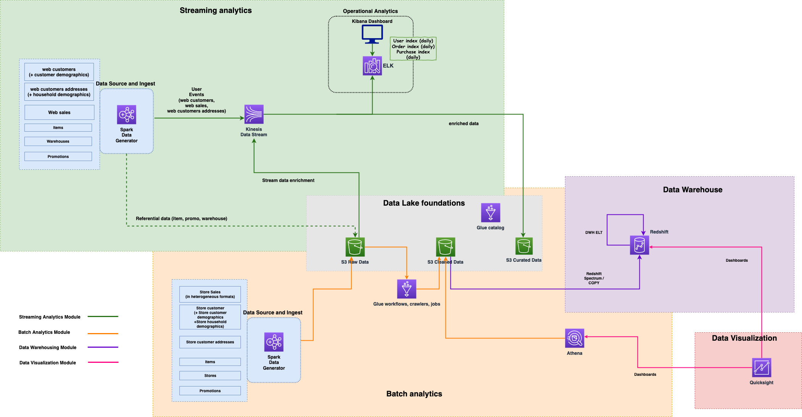

## Architecture

MyStore’s analytics platform is implemented in purpose built modules. They are decoupled and can be independently provisioned but still integrate with each others in the global platform. Currently available modules are:

* Data Lake foundations: this mandatory module is the core of the analytics platform. It contains the data lake storage and associated metadata for both batch and streaming data.
* Batch analytics: this module is in charge of ingesting and processing data from Stores channel generated by the legacy systems in batch mode. Data is then exposed to other modules for downstream consumption.
* Streaming analytics: this module is ingesting and processing real time data from the Web channel generated by cloud native systems. The solution minimizes data analysis latency but also to feed the data lake for downstream consumption.
* Data Warehouse: this module is ingesting data from the data lake to support reporting, dashboarding and adhoc querying capabilities. The module is using ELT to transform the data from the Data Lake foundations module.
* Data Vizualization: this module is providing dashboarding capabilities to business users like data analysts on top of the Data Warehouse module, but also data exploration on top of Data Lake module.

