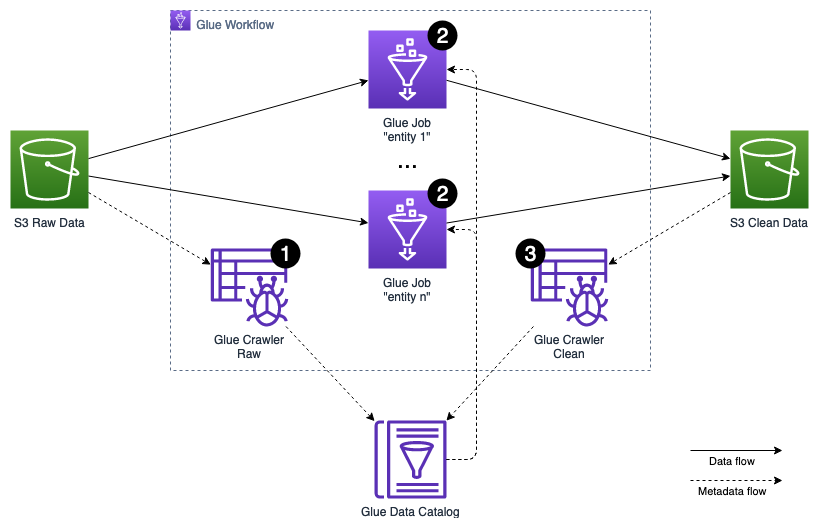

## Data pipeline

The periodically ingested batch data, stored in the *raw data* S3 bucket, has to be cleansed and normalized on its format, 
before it gets stored in the *clean data* S3 bucket to be processed by any downstream data lake consumers.

The data preparation process leverages various features of [AWS Glue](https://aws.amazon.com/glue/), 
a serverless data integration service that makes it easy to discover, prepare, and combine data for analytics, machine learning, and application development via Apache Spark framework.
The orchestration of the preparation is handled using [AWS Glue Workflows](https://docs.aws.amazon.com/glue/latest/dg/workflows_overview.html) 
that allows managing and monitoring executions of ETL activities involving multiple crawlers, jobs, and triggers. 
The metadata management is implemented via [AWS Glue Crawlers](https://docs.aws.amazon.com/glue/latest/dg/add-crawler.html), 
a serverless process that crawls data sources and sinks to extract the metadata including schemas, statistics and partitions, and saves them in the AWS Glue Data Catalog.

The following steps outline the activities involved in the preparation process, which gets triggered on a regular interval, 
e.g. every 30 minutes:

The AWS Glue Workflow maintains strict dependencies between each level of the execution. Only if all activities on a certain level finished successfully, 
the activities of the next level get started.

1. An AWS Glue Crawler is triggered to scan the *raw data* S3 bucket for newly arrived data entities, partitions, and schemas.
The crawler stores and updates the extracted metadata in the *raw* database in the AWS Glue Data Catalog.
2. The actual cleansing and transformation of the data is implemented as an AWS Glue ETL Script, using PySpark, and executed as an [AWS Glue Job](https://docs.aws.amazon.com/glue/latest/dg/author-job.html).
Each entity, like *customer*, *customer address*, *sale*, etc., is processed by an independent job.
Each job reads its entity's raw data from the *raw data* S3 bucket, leveraging the metadata stored in the *raw* database of the AWS Glue Data Catalog.
It then applies cleansing and data type, as well as data format transformations.
Finally, it stores the result partitioned by event date in Parquet format into the *clean data* S3 bucket.
3. An [AWS Glue Crawler](https://docs.aws.amazon.com/glue/latest/dg/crawler-running.html) is triggered to scan the *clean data* S3 bucket for newly arrived data entities, partitions, and schemas.
The crawler stores and updates the extracted metadata in the *clean* database in the AWS Glue Data Catalog.
The *clean* database can be leveraged by the data lake downstream consumers.
 
A more detailed description of the batch processing challenges and how to solve them can be found in the [Batch Analytics Solutions](../../../solutions/data-preparation) section.