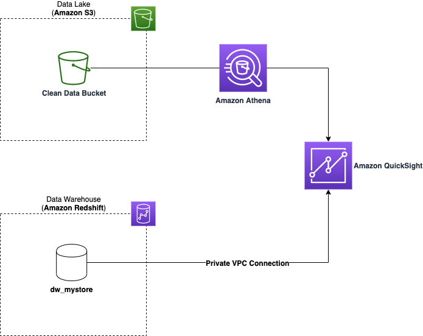

## Architecture
The data visualization provide a single entry point to analyze the different data sources and extract value via dashboards, reports and adhoc analysis.

It is implemented with [Amazon Quicksight](https://aws.amazon.com/quicksight/), a scalable, serverless, embeddable and machine learning-powered business intelligence tool.
Amazon QuickSight is connected to the data lake via Amazon Athena and the data lake via Amazon Redshift using direct query mode, in opposition to the caching mode with [SPICE](https://docs.aws.amazon.com/quicksight/latest/user/spice.html).

## Data Lake

The following steps outline the connection of Amazon QuickSight to the data lake:

1. An Amazon Athena [data source](https://docs.aws.amazon.com/quicksight/latest/user/working-with-data-sources.html) is used in Amazon QuickSight in order to connect to the data in the data lake.
2. An Amazon QuickSight [data set](https://docs.aws.amazon.com/quicksight/latest/user/working-with-data-sets.html) is created, with a direct SQL query to the clean data within the data lake - this data set can be used to create self-service analysis of the data.
3. A pre-built dashboard is deployed which provides visualisation of the data lake Clean data. 

## Data Warehouse

The following steps outline the connection of Amazon QuickSight to the data lake:

1. As the Amazon Redshift cluster is within a private subnet, a VPC connection is made from Amazon QuickSight to the VPC.
2. An Amazon Redshift [data source](https://docs.aws.amazon.com/quicksight/latest/user/working-with-data-sources.html) is used in Amazon QuickSight in order to connect to the data lake, using credentials for a data analyst user.
3. An Amazon QuickSight [data set](https://docs.aws.amazon.com/quicksight/latest/user/working-with-data-sets.html) is created, with a direct SQL query to the data lake - this data set can be used to create self-service analysis of the data.
4. A pre-built dashboard is deployed which provides visualisation of the data within the data lake. 

