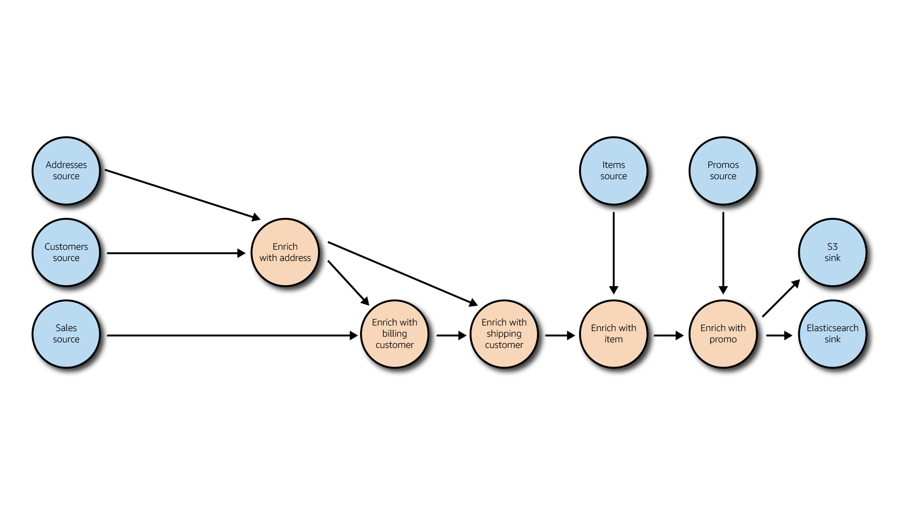

## Data pipeline

The data stream is ingested in a streaming bus then consumed and processed into a streaming engine before being written to an operational data store.

The data is ingested in [Amazon Kinesis Data Stream](https://aws.amazon.com/kinesis/data-streams/), a scalable and durable real-time streaming bus used as the source for real-time analytics pipelines.
The processing of the events is handled by Amazon [Kinesis Data Analytics](https://aws.amazon.com/kinesis/data-analytics/), a serverless Apache Flink service that allows to build powerful real-time processing logic.
The operational data store relies on [Amazon Elasticsearch Service](https://aws.amazon.com/elasticsearch-service/), a fully managed search service compatible with Elasticsearch APIs, also including a managed [Kibana](https://aws.amazon.com/elasticsearch-service/the-elk-stack/kibana/) to built real-time dashboarding

The following steps outline the different components involved in the streaming analytics platform:

1. Amazon Kinesis Data Stream ingests customers, addresses and sales events in real time in dedicated [Data Streams](https://docs.aws.amazon.com/streams/latest/dev/amazon-kinesis-streams.html). The number of shards is determined by the volume of data
2. [Events are consumed](https://docs.aws.amazon.com/streams/latest/dev/kda-consumer.html) by a single [Amazon Kinesis Analytics for Apache Flink application](https://docs.aws.amazon.com/kinesisanalytics/latest/java/how-creating-apps.html) 
3. The Apache Flink application is processing the events (see [Data Processing](#data-processing))

## Streamed data

The streamed data is composed of events on ***customers***, ***addresses*** and ***sales***. A new event is streamed for creation or update on these objects.

***Sales*** contain references to ***customers*** by *ID*, and ***customers*** contain references to ***addresses*** by *ID*.

## Reference data

Reference data is slowly moving and stored in the data lake as on or multiple file. Theses files can be in CSV (in raw layer) or Parquet formats (in clean layer) for example. In our case, the reference data is ***Items*** and ***Promos***.

## Data processing

Apache Flink is used because it provides powerful features such as:

- low latency processing
- watermarking for event-time processing
- per-operator parallelism for horizontal scaling
- complex event processing (CEP)
- able to asynchronously access external systems (REST APIs, databases, ...)
- snapshots and savepoints
- exactly once processing

This application is stateful and leverages RocksDB internally to store the various states for data and operators.

The application successively joins streams with other streams and reference data to enrich an order and denormalise it.

When the denormalised event is generated, it's stored in Amazon S3 Curated bucket and sent to Amazon Elasticsearch Service for indexing and exposition.

In the future, the application could asynchronously call a REST API for data enrichment such as geocoding (find latitude and longitude from a postal address).

## Data exposition

Amazon Elasticsearch Service is also responsible for serving real-time visualisation queries of the streamed data via search queries, 
and securing the data with [fine-grained access control](https://docs.aws.amazon.com/elasticsearch-service/latest/developerguide/fgac.html), 
with a granularity donw to the field level.

Included in Amazon Elasticsearch Service, [Kibana](https://docs.aws.amazon.com/elasticsearch-service/latest/developerguide/es-kibana.html) gives the user the ability to discover, visualize and search the indexed data.

As Elasticsearch indexes data in a new index for the first time, it tries to guess the structure of the data. In doing so, it creates a very heavy data structure that can usually be optimised.

An optimised index template is therefore being registered once with the index name pattern to be used every time a new index matching the pattern is created.